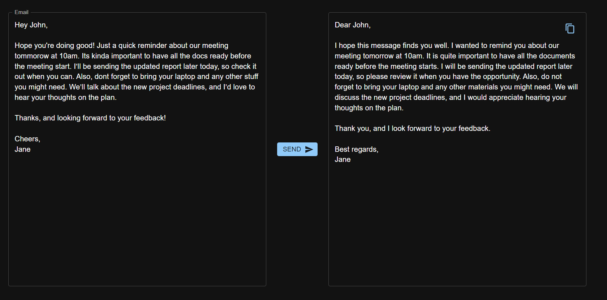

# Utility AI App

An AI-powered application that offers a suite of utilities to enhance productivity and streamline tasks. This app includes features like email proofreading, grammar styling, and JSON generation from JSON-like data.


A screenshot of Utility AI in action.



The email proofreader.

## Features

- **Email Proofreader**: Automatically proofreads your emails, checking for grammar, spelling, and punctuation errors to ensure clear and professional communication.
  
- **Grammar Stylist**: Enhances the style of your writing by suggesting better word choices, sentence structures, and overall readability improvements.

- **JSON Generator**: Converts JSON-like data into valid JSON, making it easy to work with structured data in your applications.

## Technologies Used

- **Frontend**: React
- **Backend**: Node.js with Express
- **APIs**: Utilizes Groq APIs for advanced text processing and data manipulation

## Getting Started

### Installation

Clone the repository:
   ```bash
   git clone https://github.com/SarthakT7/utility-ai.git
